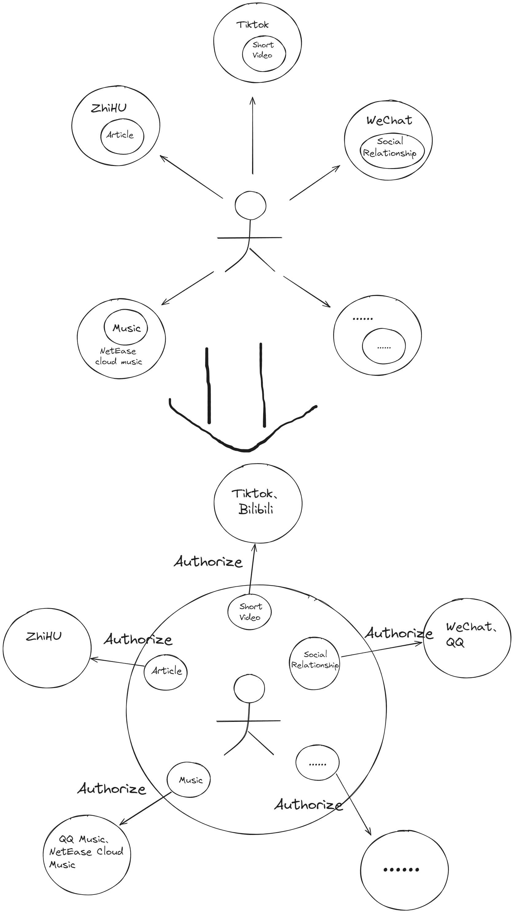
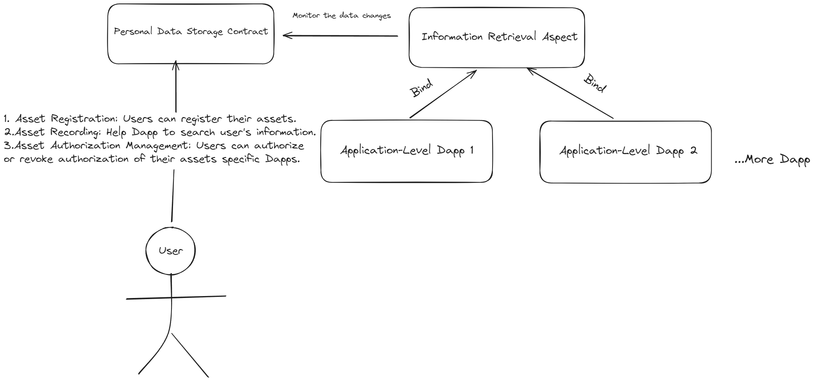

# information-retrieval-aspect
An idea of Artela aspect use case.
## Project Background
### Membership Assetization and Data Decentralization
Inspired by the membership model, we view membership as an asset purchased by users, with its value reflected in access to enhanced services. Contrary to the traditional centralized storage of member data in apps, our goal is to revolutionize this approach by transferring both asset ownership and data control back to the users, ensuring autonomy and security.

### Asset Diversification and the Limitations of Web2
Our ambition extends beyond just membership NFTs to include a variety of user assets such as articles, music, photos, and videos. The ownership of these assets will also revert to users, breaking free from the Web2 paradigm where control over digital assets predominantly lies with service providers, thus enhancing user freedom and privacy.

## Innovations
- Returning Asset Ownership to Users: We aim to restore the ownership of diverse user assets, including articles, music, photos, and videos, to the individuals themselves.
- Building a Future Web3 Application Ecosystem: In this ecosystem, data ownership resides with the users. Applications can access this data only with the user's explicit consent, leading to a truly decentralized approach in data management and service experience.
## Implementation
1. Personal Data Storage Contract:
    - This contract allows users to register their assets, such as NFT contract addresses, making them queryable by applications.
    - Users can record and store their digital assets (e.g., articles, videos) directly on the blockchain or via IPFS hashes, adhering to specific protocols for accessibility by various applications.
    - The contract enables users to grant or revoke authorization of their assets to specific Dapps.
2. Information-Retrieval-Aspect Implementation：
    - This aspect is linked to the personal data storage contract. Application-level Dapps can bind to this aspect. Upon initialization, Dapps call the information-retrieval-aspect to retrieve data assets authorized for that Dapp, allowing for normal data display.
    - The aspect can monitor changes in data authorization in the personal data storage contract and immediately relay these changes to the Dapp.
3. Application-Level Dapp Implementation：

- Creators authorize their content through the personal data storage contract, and Dapps display this content. Viewers can access these contents via the Dapp.
 1. On DeFi platforms, after user login, the system checks whether the user's assets include the platform's membership NFT, enabling access to premium features.
 2. Decentralized forums can publish user-authorized articles, making them accessible to other users.
 3. More other Dapps....
 
## The value that this Aspect brings to the Artela Ecosystem And Further Possibilities
1. Creator Economic Incentives: Track the original creators based on application-level Dapp viewership and provide them with novel creative incentives.
2. Building a Future Web3 Application Ecosystem: In this ecosystem, data is entirely owned by users. Applications can access this data only with user authorization, achieving a truly decentralized data management and service experience.
3. Enhancing NFT Usability: Through an authorization mechanism, users can utilize their image NFTs as avatars, music NFTs as background music, etc., increasing the practical value of NFTs.
4. Cross-Chain Functionality of Aspect: The cross-chain binding and query functionality will enable digital assets to be applied and transferred across different blockchains.